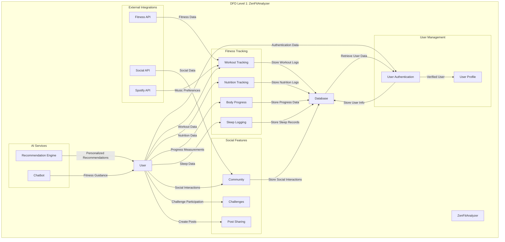
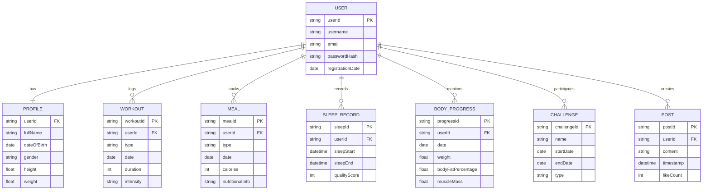

# ZenFitAnalyzer: Comprehensive Health & Fitness Tracking Platform

## 🌟 Project Overview

ZenFitAnalyzer is an innovative, full-stack health and wellness tracking application developed by Group H during their academic year. The platform provides users with a holistic approach to managing their fitness journey, combining advanced technology with user-friendly design.

## 👥 Project Team

**Group H - 10 Members**
- **Project Duration**: Last Academic Year
- **Roles**: 
  - Full-stack Development
  - UI/UX Design
  - API Integration
  - Testing and Quality Assurance

## 🚀 Key Features

1. 🔐 **User Authentication**
   - Secure registration and login
   - Profile management
   - JWT-based authentication

2. 🍽 **Nutrition Tracking**
   - Meal logging and tracking
   - Personalized meal recommendations

3. 💪 **Workout Management**
   - Custom fitness routines
   - Exercise tracking
   - Workout tutorials

4. 📊 **Progress Tracking**
   - Body measurements
   - Weight tracking
   - BMI calculation

5. 🌙 **Sleep Analysis**
   - Sleep pattern monitoring
   - Quality assessment

6. 🏃‍♀️ **Activity Tracking**
   - GPS-based exercise tracking
   - Real-time location updates

7. 🎵 **Music Integration**
   - Spotify workout playlist support

8. 👥 **Social Features**
   - Community feed
   - Fitness challenges
   - Social sharing

9. 🤖 **AI-Powered Assistance**
   - Intelligent fitness chatbot
   - Personalized recommendations

## 🛠 Technology Stack

### Frontend
- **Framework**: React.js with Vite
- **Styling**: Tailwind CSS
- **State Management**: Context API
- **Routing**: React Router
- **HTTP Client**: Axios
- **Additional Libraries**: 
  - React Icons
  - Recharts (Data Visualization)
  - React Toastify
  - React Webcam

### Backend
- **Runtime**: Node.js
- **Framework**: Express.js
- **Database**: MongoDB with Mongoose
- **Authentication**: JWT, bcrypt
- **File Handling**: Multer, Cloudinary
- **Additional Services**:
  - Nodemailer (Email)
  - Socket.io (Real-time Communication)
  - TensorFlow.js (AI Integration)
  - Spotify Web API

## 🔧 Quick Setup

### Prerequisites
- Node.js (v16+)
- npm (v8+)
- MongoDB

### Frontend Setup
```bash
cd frontend
npm install
npm run dev
```

### Backend Setup
```bash
cd Backend
npm install
npm start
```

## 📂 Project Structure

```
ZenFitAnalyzer/
├── frontend/
│   ├── src/
│   │   ├── components/
│   │   ├── pages/
│   │   ├── context/
│   │   └── services/
├── Backend/
│   ├── controllers/
│   ├── models/
│   ├── routes/
│   └── middlewares/
```

## 🌐 Key API Endpoints

- `/users/register`: User registration
- `/users/login`: User authentication
- `/body-progress/add`: Log body progress
- `/sleep/track`: Track sleep patterns
- `/challenge/create`: Create fitness challenges

## 🚀 Deployment

### Backend
- Supported Deployment Platforms:
  - Heroku
  - AWS
  - DigitalOcean
  - Docker

### Frontend
- Supported Hosting Platforms:
  - Netlify
  - Vercel
  - GitHub Pages

## 🔒 Security Features

- Password hashing with bcrypt
- JWT-based authentication
- Input validation
- CORS configuration
- Secure route protection

## 🗺 Future Roadmap

- Mobile app development
- Advanced AI recommendations
- Wearable device integrations
- Enhanced analytics dashboard

## 🤝 Contributing

Contributions are welcome! Please follow these steps:
1. Fork the repository
2. Create a feature branch
3. Commit your changes
4. Push to the branch
5. Open a Pull Request

## 📜 License

Distributed under the MIT License.

## 📞 Contact

**Project Maintainers**:
- Team Lead Email: [team_lead_email@example.com]
- Project Repository: [GitHub Repository URL]

## 🙏 Acknowledgments

- College Mentors
- Project Guides
- Open Source Community
- All Team Members of Group H

## 🏆 Achievements

- Comprehensive full-stack health tracking solution
- Innovative use of AI and machine learning
- Seamless user experience
- Robust and scalable architecture

## 🔄 Data Flow Diagram (Level 1)



### Level 1 DFD Detailed Breakdown

#### 1. User Management
- **User Authentication**
  - Handles user registration and login
  - Verifies user credentials
  - Manages access control
  - Generates and validates authentication tokens

- **User Profile**
  - Manages user personal information
  - Stores and updates user details
  - Handles profile customization

#### 2. Fitness Tracking Subsystems
- **Workout Tracking**
  - Logs exercise and physical activities
  - Integrates with Fitness API
  - Tracks workout types, duration, and intensity
  - Supports music integration via Spotify API

- **Nutrition Tracking**
  - Records meal information
  - Calculates nutritional intake
  - Provides dietary insights

- **Body Progress**
  - Monitors physical measurements
  - Tracks weight, body fat percentage
  - Generates progress reports

- **Sleep Logging**
  - Records sleep patterns
  - Analyzes sleep quality
  - Provides sleep health insights

#### 3. Social Features
- **Community**
  - Enables user interactions
  - Supports social feed
  - Integrates with Social API

- **Challenges**
  - Creates and manages fitness challenges
  - Tracks user participation
  - Provides leaderboards and motivation

- **Post Sharing**
  - Allows users to share achievements
  - Supports multimedia posts
  - Enables social engagement

#### 4. AI Services
- **Recommendation Engine**
  - Generates personalized fitness suggestions
  - Analyzes user data and patterns
  - Provides tailored workout and nutrition plans

- **Chatbot**
  - Offers AI-powered fitness guidance
  - Answers user queries
  - Provides motivational support

#### 5. External Integrations
- **Fitness API**
  - Imports external fitness data
  - Enhances tracking capabilities

- **Social API**
  - Enables social media integrations
  - Supports sharing and connectivity

- **Spotify API**
  - Integrates workout music
  - Provides personalized playlists

#### Data Flow and Storage
- Bidirectional data exchange with central database
- Secure storage of user-generated content
- Real-time data synchronization
- Comprehensive data management across subsystems

### Key Interactions
- Centralized user data management
- Seamless integration of fitness tracking
- AI-powered personalization
- Social and motivational features
- Robust external API integrations

## 📊 Entity-Relationship (ER) Diagram



### ER Diagram Explanation
- **User-Centric Design**: All entities are connected to the USER entity
- **One-to-One Relationships**: 
  - User has one Profile
- **One-to-Many Relationships**:
  - User can log multiple Workouts
  - User can track multiple Meals
  - User can record multiple Sleep Records
  - User can monitor Body Progress
  - User can participate in multiple Challenges
  - User can create multiple Posts